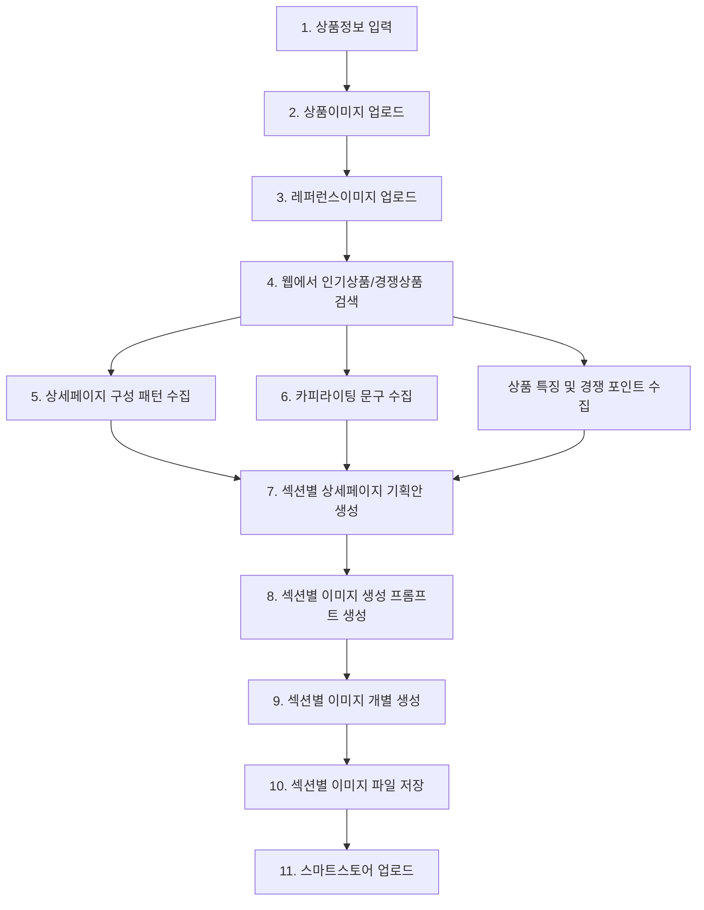

# 스마트스토어 상세페이지 자동 생성 최종 플로우

## 문서 목적

이 문서는 스마트스토어 상세페이지를 자동으로 제작하기 위한 최종 작업 흐름을 정리한 문서이다.  
핵심 목표는 상품정보, 상품이미지, 레퍼런스이미지를 입력하면 웹 수집, 기획, 디자인 생성, 섹션별 이미지 출력까지 자동화하는 것이다.

상세페이지는 하나의 긴 이미지로 출력하지 않고, **섹션별 개별 이미지 파일**로 출력하는 방식을 기준으로 한다.

---

# 1. 전체 최종 플로우

```text
1. 상품정보 입력
2. 상품이미지 업로드
3. 레퍼런스이미지 업로드
4. 웹에서 인기상품/경쟁상품 검색
5. 상세페이지 구성 패턴 수집
6. 카피라이팅 문구 수집
7. 섹션별 상세페이지 기획안 생성
8. 섹션별 이미지 생성 프롬프트 생성
9. 섹션별 이미지 개별 생성
10. 섹션별 이미지 파일 저장
11. 스마트스토어 업로드
```

---

# 2. 플로우 차트



---

# 3. 단계별 상세 설명

## 1단계. 상품정보 입력

상세페이지 제작에 필요한 기본 정보를 입력한다.

### 입력 항목

| 항목 | 설명 |
|---|---|
| 상품명 | 스마트스토어에 등록할 상품명 |
| 브랜드명 | 브랜드 또는 판매자명 |
| 카테고리 | 의류, 잡화, 생활용품, 식품 등 |
| 가격대 | 상품 가격 또는 목표 판매가 |
| 소재 | 원단, 재질, 구성 성분 |
| 사이즈 | 사이즈표, 측정 기준 |
| 색상 | 상품 컬러 옵션 |
| 기능 | 방수, 통기성, 보온성, 수납력 등 |
| 특징 | 경쟁 상품과 다른 차별점 |
| 타깃 고객 | 주 구매 고객층 |
| 사용 상황 | 착용, 사용, 보관, 선물 등 활용 장면 |

---

## 2단계. 상품이미지 업로드

실제 상세페이지에 사용할 상품 이미지를 업로드한다.

### 필요한 이미지 유형

| 이미지 유형 | 설명 |
|---|---|
| 메인 상품 이미지 | 상품 전체가 잘 보이는 대표 이미지 |
| 디테일컷 | 소재, 봉제, 기능, 마감 등을 보여주는 이미지 |
| 착용컷 / 사용컷 | 실제 사용 상황을 보여주는 이미지 |
| 패키지 이미지 | 포장 상태, 구성품 이미지 |
| 비교 이미지 | 기존 제품 또는 다른 상품과 비교 가능한 이미지 |

---

## 3단계. 레퍼런스이미지 업로드

원하는 디자인 방향과 분위기를 정하기 위해 참고 이미지를 업로드한다.

### 레퍼런스 이미지 기준

| 항목 | 설명 |
|---|---|
| 디자인 분위기 | 미니멀, 고급형, 감성형, 기능성, 캐주얼 등 |
| 레이아웃 | 이미지 배치, 텍스트 위치, 여백 구성 |
| 컬러톤 | 전체적인 색감과 배경 톤 |
| 카피 스타일 | 짧고 강한 문구, 설명형 문구, 감성 문구 등 |
| 섹션 구성 | 메인, 기능 설명, 비교표, 후기, 구매 유도 등 |

---

## 4단계. 웹에서 인기상품 / 경쟁상품 검색

입력된 상품정보를 기준으로 웹에서 비슷한 인기상품과 경쟁상품을 검색한다.

### 검색 대상

| 검색 대상 | 목적 |
|---|---|
| 네이버쇼핑 인기상품 | 현재 잘 팔리는 상품 구조 파악 |
| 스마트스토어 상위 상품 | 실제 상세페이지 구성 참고 |
| 쿠팡 / 오늘의집 / 무신사 등 | 카테고리별 판매 방식 참고 |
| 브랜드몰 | 고급형 상세페이지 구성 참고 |
| 고객 리뷰 | 구매자가 중요하게 보는 포인트 파악 |

---

## 5단계. 상세페이지 구성 패턴 수집

경쟁상품의 상세페이지를 분석하여 어떤 순서로 상품을 설득하는지 수집한다.

### 수집 항목

| 항목 | 설명 |
|---|---|
| 첫 화면 구성 | 메인 비주얼, 대표 카피, 상품명 배치 |
| 문제 제기 방식 | 고객의 불편함을 어떻게 보여주는지 |
| 해결 방식 | 상품 장점을 어떻게 연결하는지 |
| 기능 설명 순서 | 핵심 기능을 어떤 순서로 설명하는지 |
| 이미지 구성 | 착용컷, 디테일컷, 비교컷 사용 방식 |
| 신뢰 요소 | 리뷰, 인증, 판매량, 브랜드 스토리 |
| 구매 유도 방식 | 마지막 섹션의 문구와 구성 |

---

## 6단계. 카피라이팅 문구 수집

상세페이지에 사용할 수 있는 문구 스타일과 표현 방식을 수집한다.

### 수집할 카피 유형

| 카피 유형 | 예시 방향 |
|---|---|
| 메인 카피 | 상품의 가장 큰 장점을 한 문장으로 표현 |
| 문제 제기 카피 | 고객이 겪는 불편함을 직관적으로 제시 |
| 해결 카피 | 이 상품이 필요한 이유를 설명 |
| 기능 카피 | 소재, 기능, 구조를 설득력 있게 표현 |
| 감성 카피 | 사용자의 라이프스타일과 연결 |
| 구매 유도 카피 | 마지막 결정을 유도하는 문구 |

---

## 7단계. 섹션별 상세페이지 기획안 생성

입력정보와 수집정보를 바탕으로 상세페이지를 섹션별로 기획한다.

### 기본 섹션 구조

| 섹션 | 역할 | 주요 내용 |
|---|---|---|
| Section 01 | 메인 비주얼 | 대표 이미지, 핵심 카피, 상품명 |
| Section 02 | 문제 제기 | 고객 불편함, 기존 제품의 아쉬움 |
| Section 03 | 해결 제안 | 이 상품이 필요한 이유 |
| Section 04 | 핵심 장점 | 주요 기능, 소재, 차별점 |
| Section 05 | 디테일 설명 | 원단, 봉제, 구조, 사이즈 |
| Section 06 | 비교 / 근거 | 경쟁상품 대비 장점, 사용 전후 비교 |
| Section 07 | 사용 장면 | 착용컷, 라이프스타일 이미지 |
| Section 08 | 신뢰 요소 | 리뷰, 인증, 판매 포인트 |
| Section 09 | 구매 유도 | 마지막 설득 문구, 추천 대상 |

---

## 8단계. 섹션별 이미지 생성 프롬프트 생성

각 섹션의 목적에 맞게 이미지 생성용 프롬프트를 따로 만든다.

### 프롬프트 구성 요소

| 요소 | 설명 |
|---|---|
| 섹션 목적 | 메인, 문제 제기, 기능 설명, 비교 등 |
| 이미지 스타일 | 미니멀, 고급형, 감성형, 기능성 등 |
| 상품 이미지 활용 방식 | 단독 배치, 확대컷, 배경 합성 등 |
| 텍스트 구성 | 제목, 부제목, 설명문 |
| 레이아웃 | 상단 이미지형, 좌우 분할형, 카드형 등 |
| 컬러톤 | 레퍼런스 이미지 기준 색상 |
| 출력 비율 | 스마트스토어 모바일 기준 세로형 이미지 |

---

## 9단계. 섹션별 이미지 개별 생성

프롬프트를 기준으로 각 섹션 이미지를 개별 생성한다.

### 생성 방식

```text
Section 01 → section_01_main.jpg
Section 02 → section_02_problem.jpg
Section 03 → section_03_solution.jpg
Section 04 → section_04_point.jpg
Section 05 → section_05_detail.jpg
Section 06 → section_06_compare.jpg
Section 07 → section_07_lifestyle.jpg
Section 08 → section_08_trust.jpg
Section 09 → section_09_closing.jpg
```

### 개별 생성 방식의 장점

- 수정이 필요한 섹션만 다시 만들 수 있다.
- 스마트스토어 업로드 관리가 편하다.
- 긴 통이미지보다 오류가 적다.
- 모바일 화면에서 가독성이 좋다.
- A/B 테스트가 가능하다.
- 섹션별 디자인 퀄리티 관리가 쉽다.

---

## 10단계. 섹션별 이미지 파일 저장

최종 생성된 이미지는 섹션별 파일명으로 저장한다.

### 권장 폴더 구조

```text
smartstore_detail_page/
 ├─ input/
 │   ├─ product_info.txt
 │   ├─ product_images/
 │   └─ reference_images/
 │
 ├─ research/
 │   ├─ competitor_products.md
 │   ├─ copywriting_samples.md
 │   └─ section_patterns.md
 │
 ├─ planning/
 │   ├─ detail_page_plan.md
 │   └─ section_prompts.md
 │
 ├─ output/
 │   ├─ section_01_main.jpg
 │   ├─ section_02_problem.jpg
 │   ├─ section_03_solution.jpg
 │   ├─ section_04_point.jpg
 │   ├─ section_05_detail.jpg
 │   ├─ section_06_compare.jpg
 │   ├─ section_07_lifestyle.jpg
 │   ├─ section_08_trust.jpg
 │   └─ section_09_closing.jpg
 │
 └─ final/
     └─ upload_checklist.md
```

---

## 11단계. 스마트스토어 업로드

생성된 섹션별 이미지를 스마트스토어 상세페이지 영역에 순서대로 업로드한다.

### 업로드 전 체크리스트

| 체크 항목 | 확인 내용 |
|---|---|
| 이미지 순서 | 섹션 순서가 자연스러운지 확인 |
| 텍스트 오타 | 이미지 안의 문구 오타 확인 |
| 모바일 가독성 | 글자가 너무 작지 않은지 확인 |
| 상품정보 정확성 | 소재, 사이즈, 기능 정보가 맞는지 확인 |
| 법적 표현 | 과장 광고, 허위 표현, 인증 오남용 여부 확인 |
| 파일 용량 | 스마트스토어 업로드 가능한 용량인지 확인 |
| 이미지 비율 | 모바일 화면에서 잘리는 부분이 없는지 확인 |

---

# 4. 자동화 시스템 구조

## 핵심 구조

```text
입력 모듈
↓
웹 수집 모듈
↓
분석 모듈
↓
상세페이지 기획 모듈
↓
섹션별 프롬프트 생성 모듈
↓
이미지 생성 모듈
↓
파일 저장 모듈
↓
스마트스토어 업로드 준비
```

---

# 5. 추천 자동화 방식

## 베스트 방식

**섹션별 기획안 생성 → 섹션별 프롬프트 생성 → 섹션별 이미지 개별 생성**

이 방식이 가장 안정적이다.

### 이유

- 품질 관리가 쉽다.
- 섹션별 수정이 가능하다.
- 자동화 실패율이 낮다.
- 이미지 생성 오류를 줄일 수 있다.
- 실제 스마트스토어 운영에 적합하다.

---

## 두 번째 방식

**전체 상세페이지 기획안 생성 → 긴 이미지 생성 → 이미지 분할**

이 방식도 가능하지만 추천도는 낮다.

### 단점

- 긴 이미지일수록 품질이 떨어질 수 있다.
- 텍스트가 깨질 가능성이 높다.
- 일부 섹션만 수정하기 어렵다.
- 모바일 가독성이 떨어질 수 있다.
- 이미지 분할 과정이 추가로 필요하다.

---

# 6. 결론

스마트스토어 상세페이지 자동화는 단순히 이미지를 만드는 작업이 아니라,  
**상품정보 분석 → 시장 조사 → 상세페이지 기획 → 섹션별 디자인 생성 → 개별 이미지 출력**으로 나누어야 한다.

최종적으로는 다음 방식이 가장 좋다.

```text
상품정보 입력
→ 웹 수집
→ 상세페이지 기획
→ 섹션별 프롬프트 생성
→ 섹션별 이미지 생성
→ 섹션별 파일 저장
→ 스마트스토어 업로드
```

핵심은 **기획안과 이미지 생성을 분리하는 것**이다.  
이렇게 해야 자동화하더라도 상세페이지의 설득력, 디자인 완성도, 수정 편의성을 모두 확보할 수 있다.
